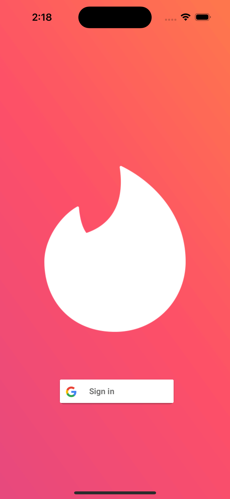
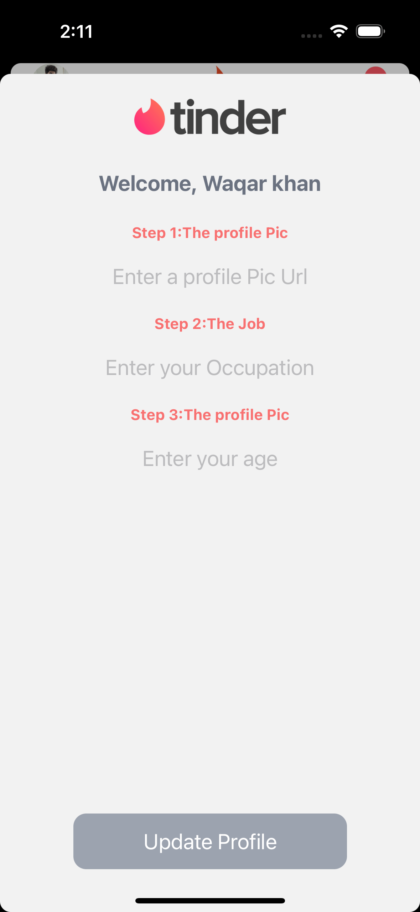
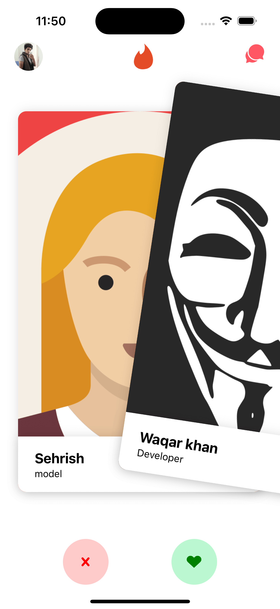
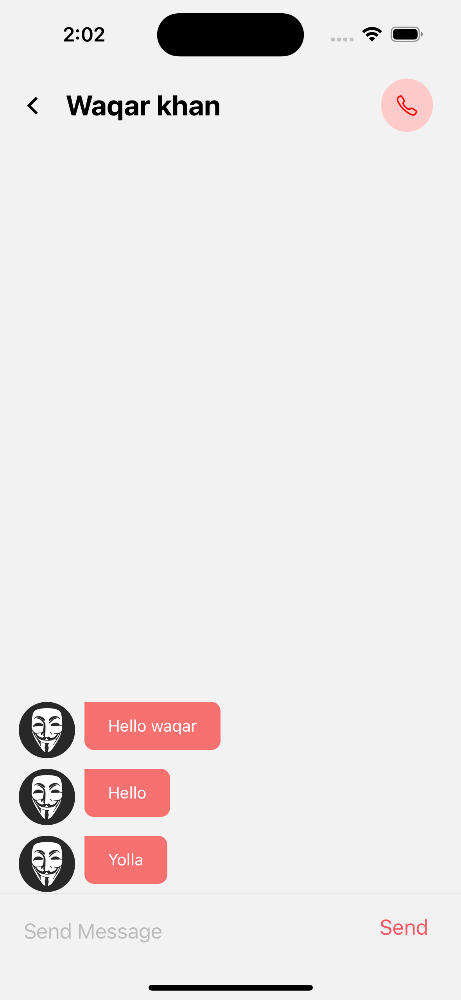
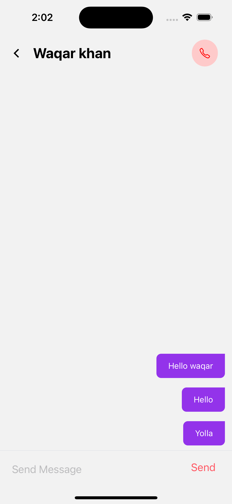
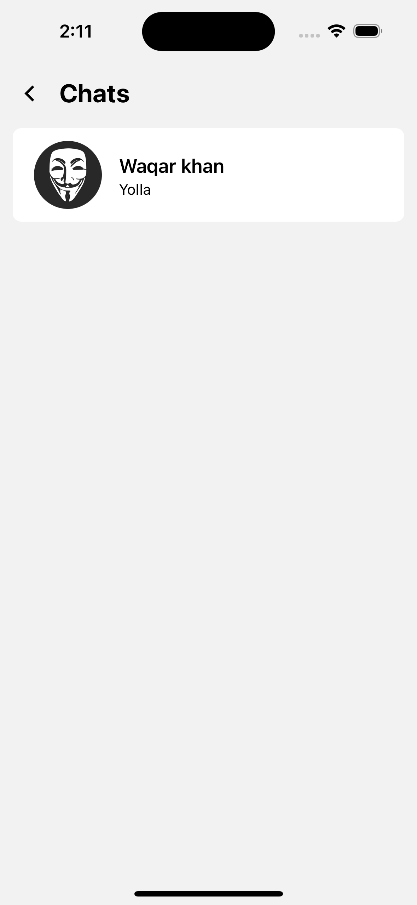

# Clone of Tinder

## step

1. use command npx create-expo-app tinder-clone

2. use command go do folder code .tinder-clone

3. add the web support `npx expo install react-dom react-native-web @expo/webpack-config`

4. run `npx expo start`

5. add tailwind class name library` yarn add twrnc`

6. add tailwind config file for autocomplete add style to the class name in tailwind autocomplete `npx tailwindcss init`

7. add React Navigation both native and stack `yarn add @react-navigation/native @react-navigation/stack`

8. add expo react navigation decencies by `npx expo install react-native-screens react-native-safe-area-context`

9. add gesture handle by `npx expo install react-native-gesture-handler`

10. add firebase to the project
    `yarn add @react-native-firebase/auth @react-native-firebase/app @react-native-google-signin/google-signin`

11. add expo build properties
    `yarn add expo-build-properties`

12. use command to clean and add to android and ios
    `npx expo prebuild --clean`

13. install react native deck swiper
    `yarn add react-native-deck-swiper`

14. add firebase to the project
    `yarn add @react-native-firebase/firestore`

15. use command to clean and add to android and ios
    `npx expo prebuild --clean`

16. run build with
    `npx expo run:ios`

# preview

| Syntax                       | Description                  | Preview                      |
| ---------------------------- | ---------------------------- | ---------------------------- |
|  |  |  |
|  |  |  |
